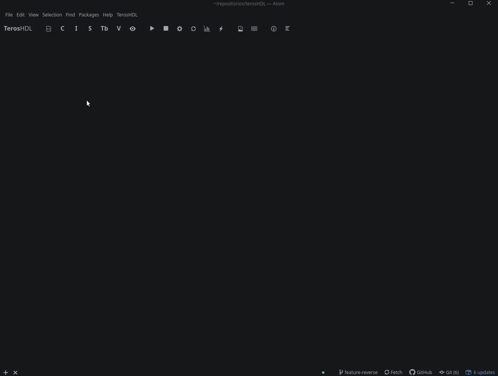
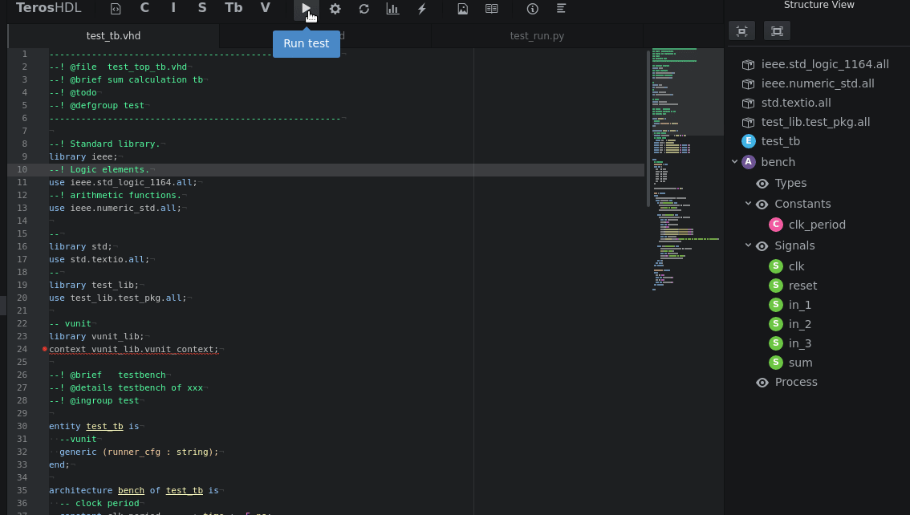
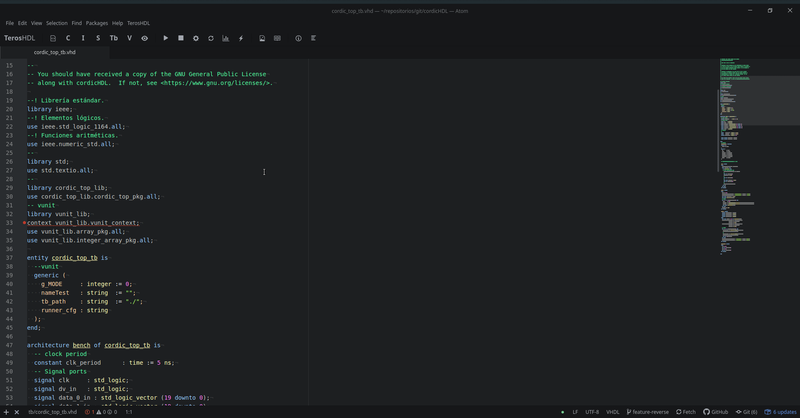
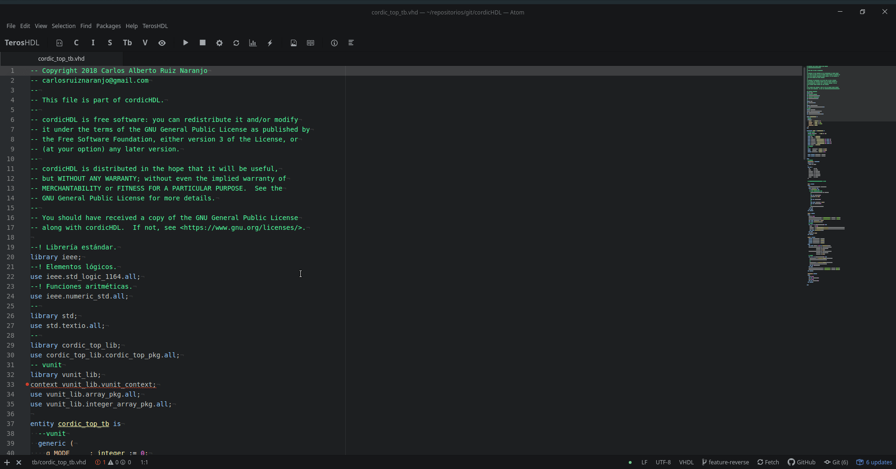
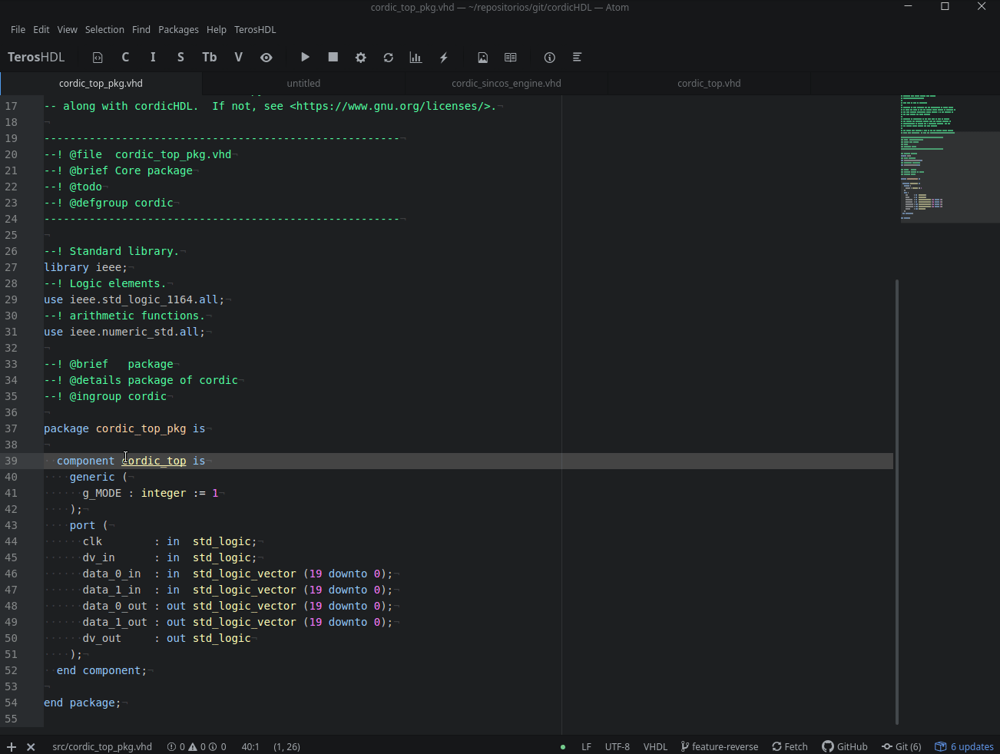
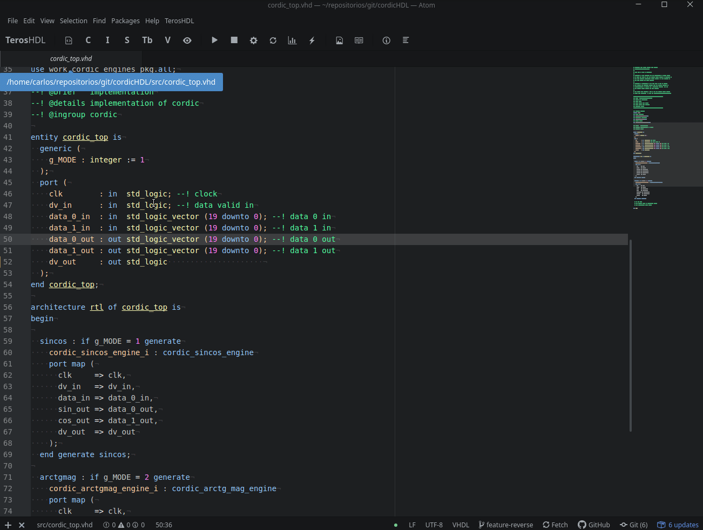
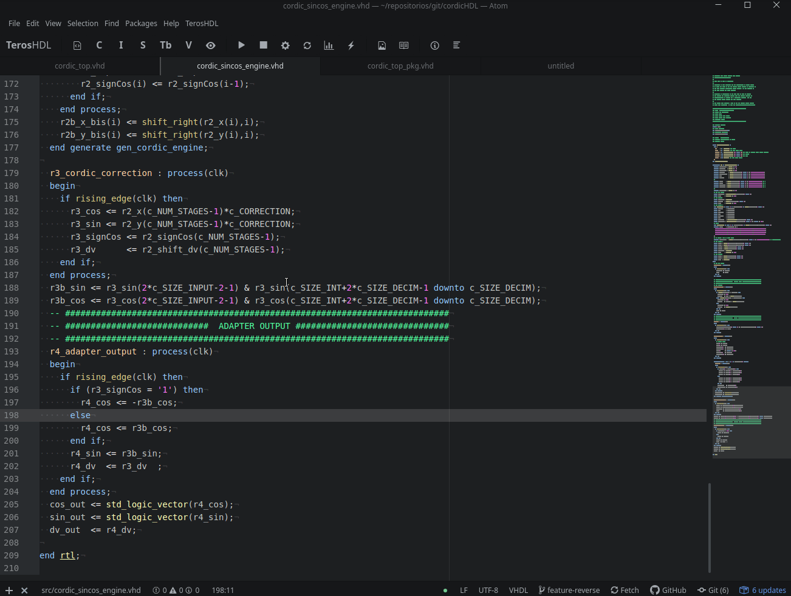
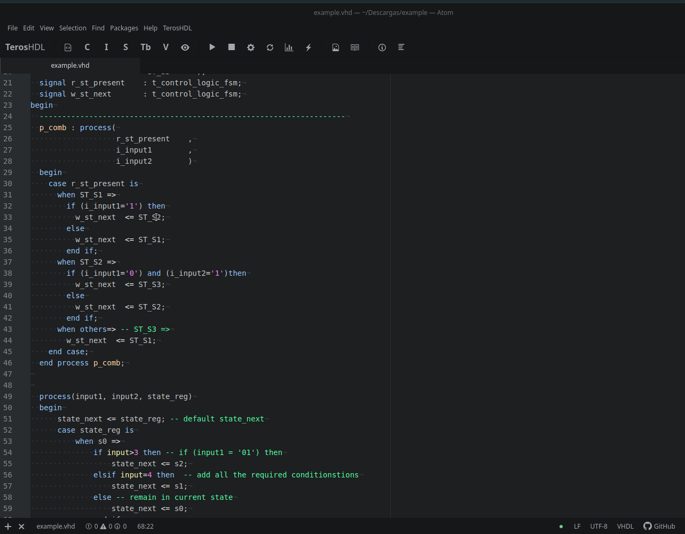

# TerosHDL

**Our philosophy is: thinking hardware, developing hardware, [take advantage software tools.](https://github.com/qarlosalberto/fpga-knife)**

The main task of TerosHDL is make the FPGA development easier and reliable.  It is a powerful open source IDE.

Currently we support:

- Ghdl.
- ModelSim.
- Vhdl
- VUnit.

Soon we will support Verilog and others simulators.


## Dependencies

- Symbolator:
```pip install symbolator```
- TerosHDLbackend:
```pip install TerosHDL```
- VUnit:
```pip install vunit_hdl```

For simulation:

- Ghdl/Modelsim

For code coverage:

- Ghdl with GCC backend.

For waveform:

- GTKWave/ModelSim

For structure-view:

- Ctags

## Installation

```apm install terosHDL```

## Getting started guide

### Configuring paths



### Runing test



### Code coverage



</br>



### Creating component diagram



### Creating port documentation



### Structure view



### State machine diagram

This is an experimental feature. Not all state machines are supported.



## User Manual

You have a complete [user manual.](https://github.com/TerosTechnology/terosHDL/blob/develop/doc/User_Manual.md)

# License

Copyright (c) 2018-Present
- Carlos Alberto Ruiz Naranjo, <carlosruiznaranjo@gmail.com>
- Ismael Pérez Rojo, <ismaelprojo@gmail.com>

TerosHDL is licensed under GPLv3.
