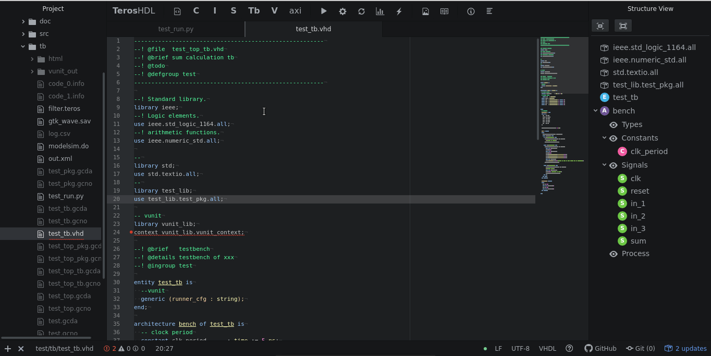

**UNDER TESTS!!!!!!!**
**UNDER TESTS!!!!!!!**
**UNDER TESTS!!!!!!!**

# TerosHDL

## Dependencies

- Symbolator:
```pip install symbolator```
- TerosHDLbackend:
```pip install TerosHDL```
- VUnit:
```pip install vunit_hdl```

For simulation:

- Ghdl/Modelsim

For code coverage:

- Ghdl with GCC backend.

For waveform:

- GTKWave/ModelSim

For structure-view:

- Ctags

## Installation

```apm install terosHDL```

## Getting started guide

### Configuring paths


### Runing test


### Code coverage



## User Manual

You have a complete [user_manual](https://github.com/TerosTechnology/terosHDL/blob/develop/doc/User_Manual.md)


# License

Copyright (c) 2018-Present
Carlos Alberto Ruiz Naranjo, <carlosruiznaranjo@gmail.com>
Ismael Pérez Rojo, <ismaelprojo@gmail.com>

TerosHDL is licensed under GPLv3.
